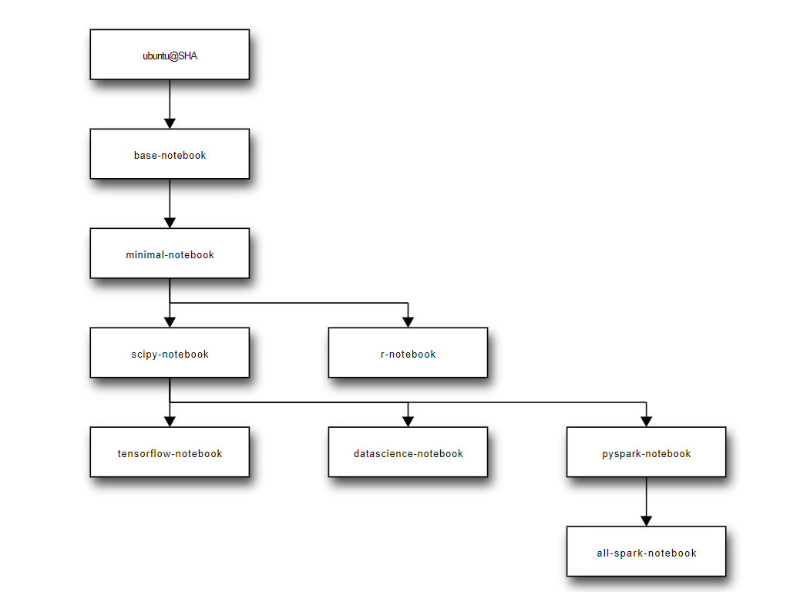

#### Setup Jupyter on AKS

##### read first:    

    https://jupyter-docker-stacks.readthedocs.io/en/latest/index.html
    https://jupyter-docker-stacks.readthedocs.io/en/latest/using/selecting.html
    https://jupyter-docker-stacks.readthedocs.io/en/latest/using/specifics.html

##### test jupyter/pyspark-notebook in WSL

    pickup jupyter/pyspark-notebook as the docker image.

    docker run -t --rm -p 8888:8888 -p 4040:4040 -p 4041:4041 jupyter/pyspark-notebook

##### start jupyter in ASK

    az acr import --name kangxhacrsea --source docker.io/jupyter/pyspark-notebook --image pyspark-notebook
    
    kubectl apply -f jupyter-aks.yaml
    kubectl get pod -n spark
    kubectl logs notebook-7686855958-klcll -n spark

